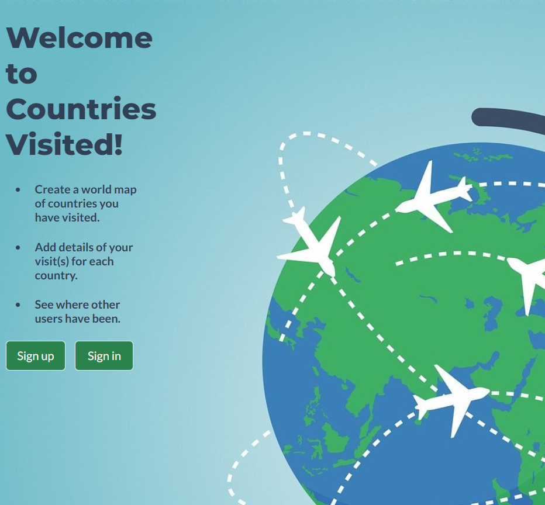
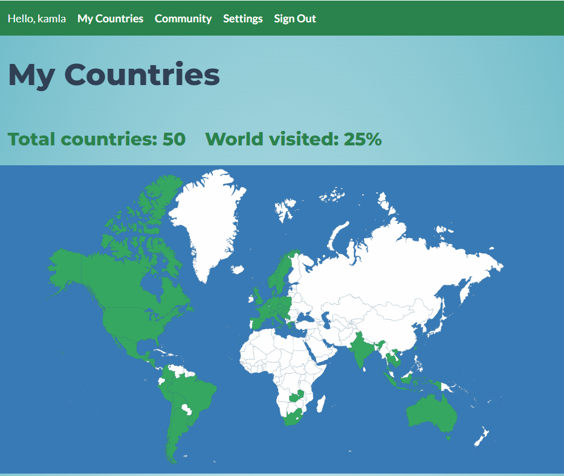
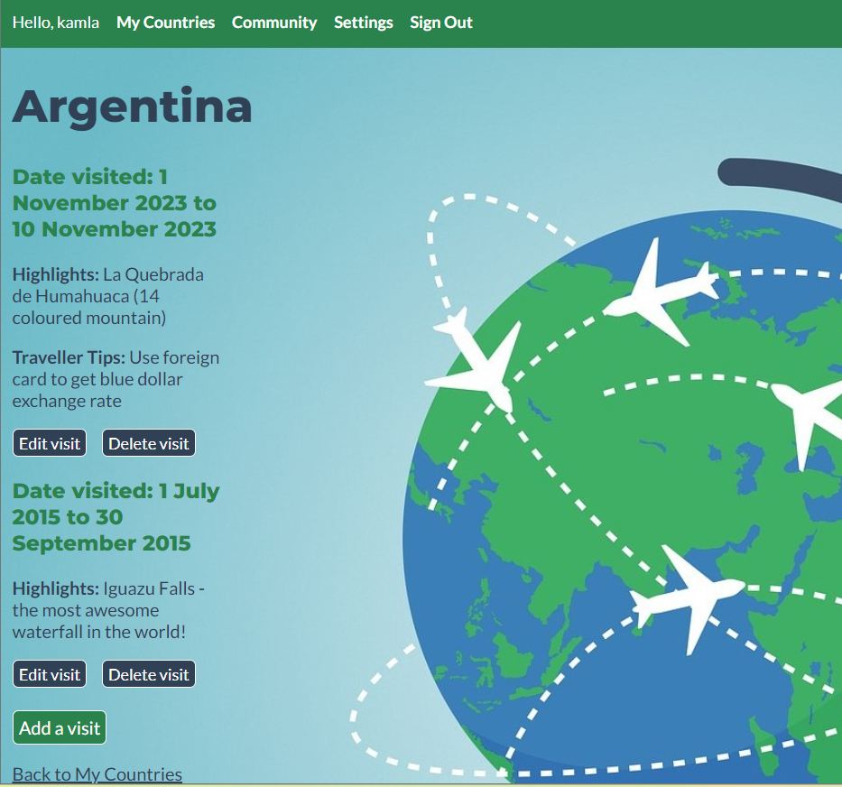
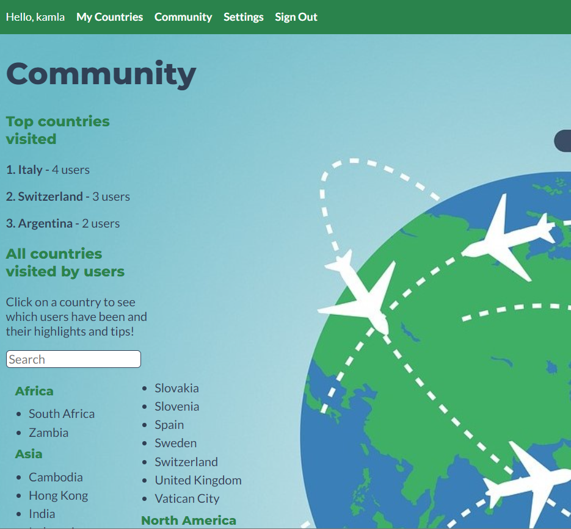
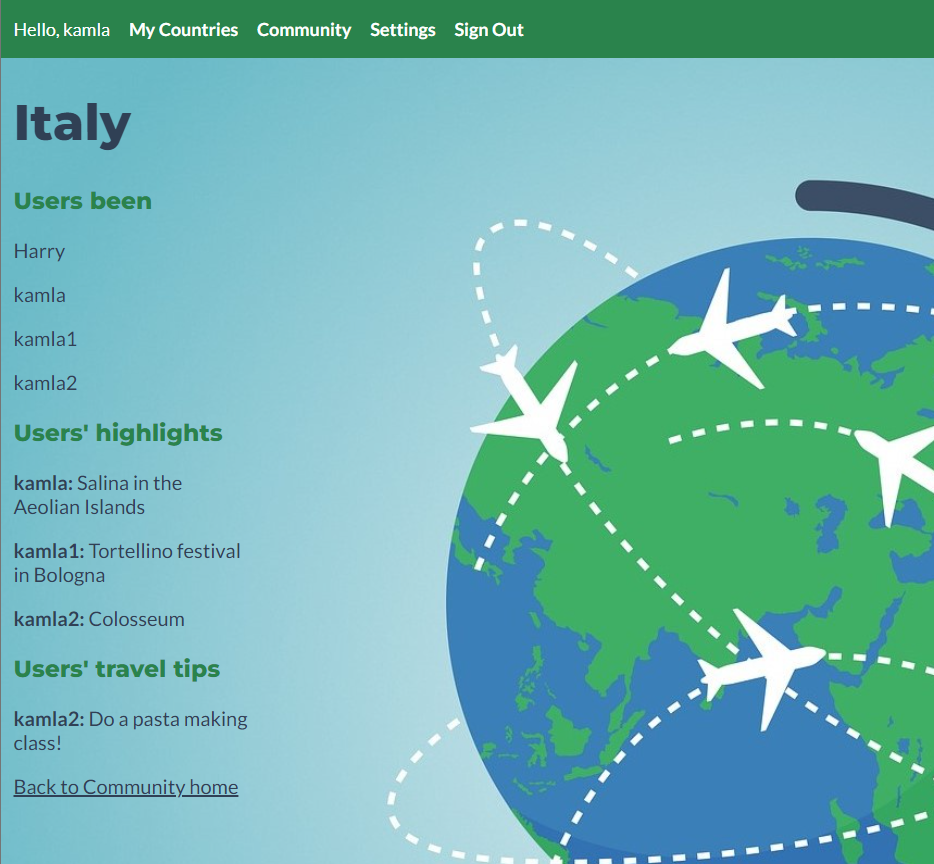
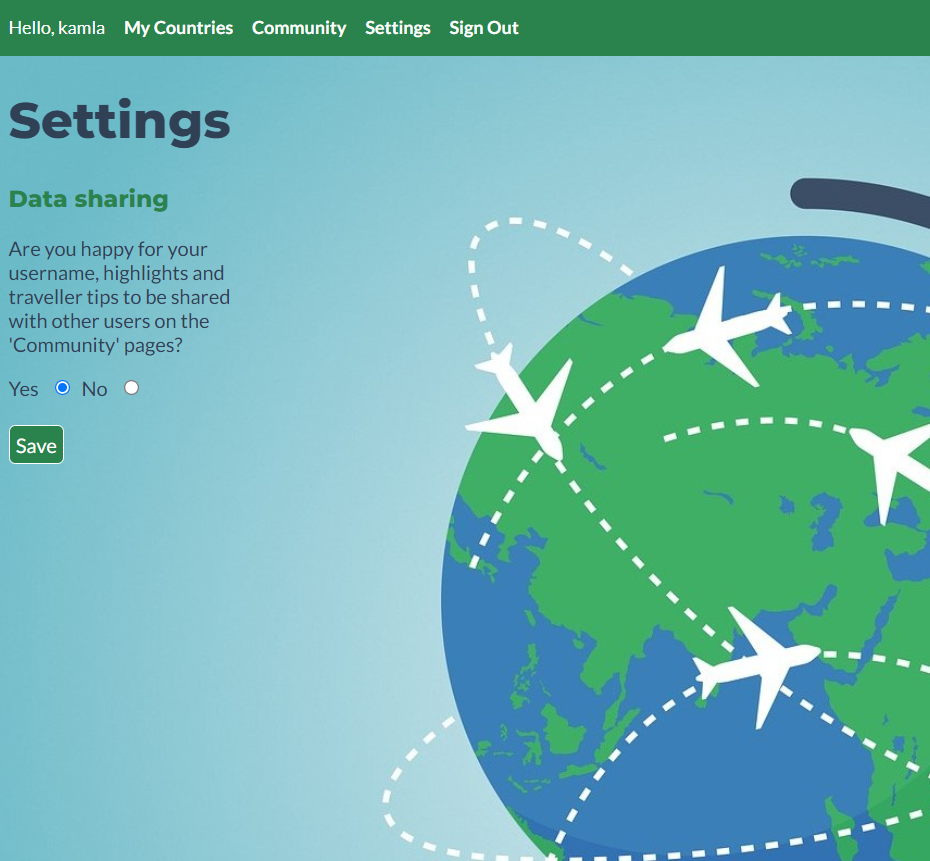

# Project 2 - Countries Visited Application

## Overview

For the second project of the General Assembly Software Engineering Course, the requirement was to make a Node/Express/MongoDB application with full CRUD. I created an application which tracks the countries a user has visited. I chose to make this application as I love to travel and keep track of where I have been.

## Description of the Application

**My Countries**

The user can create an account on the website, and once logged in the user can log each country they have been to. The user's countries appears both as a list and visually on a world map.

In addition, the user can log visits to each country including the dates of each visit and (optionally) their highlights and traveller tips.

**Community**

There is a community page where the user can see the top 3 countries visited by all users of the application and a list of all countries visited. 

Each country has a link to its own page where the user can see the usernames of the other users who have been together with their highlights and traveller tips. A user can opt out of their information apeparing on this page under 'Data sharing' in 'Settings'.

## Deployed Application

[Link to the deployed version here](https://main--kamlasm-countries-visited.netlify.app) 

## Application Setup 

**Schemas**

I created three mongoose schemas for the User, Country and Visit. I seeded the Country schema with a list of all countries/territories. Each schema references the other schemas. 

```JS
const userSchema = new mongoose.Schema({
    username: { type: String, required: true },
    password: { type: String, required: true },
    shareData: { type: Boolean, required: true, default: true },
    countriesVisited: [{ type: mongoose.Schema.ObjectId, ref: 'Country'}], 
    visitsMade: [{ type: mongoose.Schema.ObjectId, ref: 'Visit'}],
})

const countrySchema = new mongoose.Schema({
    name: { type: String, required: true },
    countryCode: { type: String, required: true },
    continent: { type: String, required: true },
    territory: { type: Boolean, required: true, default: false},
    visitors: [{type: mongoose.Schema.ObjectId, ref: 'User'}],
    visits: [{type: mongoose.Schema.ObjectId, ref: 'Visit'}]
})

const visitSchema = new mongoose.Schema({
    countryName: { type: mongoose.Schema.ObjectId, ref: 'Country', required: true },
    startDate: { type: Date, required: true },
    endDate: { type: Date, required: true },
    highlights: { type: String, required: false },
    travellerTips: { type: String, required: false },
    images: [{ type: String, required: false }],
    createdBy: { type: mongoose.Schema.ObjectId, ref: 'User', required: true },
})
```
**CRUD**

The application has full CRUD fuctionality to enable users to:

- Create a new account, sign in and sign out 
- Add and delete countries from their list
- Add, edit and delete visits for each country
- View a community page and individual country pages

**Map**

My favourite feature of the application is the map. I sourced an svg world map which I embedded into the user homepage. Each path element in the svg file represents a country and has an id of the country code. Each of the user's countries listed on the homepage has a class of the country code. I added an event listener to the page to look for the country code of the user's countries in the svg file and add a class of 'visited' to the matching paths, which sets the fill of that path to green, thereby displaying the user's personal travel map!

```JavaScript
function colourCountries() {
    const svgCountries = document.querySelectorAll('path')

    svgCountries.forEach(svgCountry => {
        svgCountry.classList.remove('visited')
    })

    const countriesVisited = document.querySelectorAll('li')

    countriesVisited.forEach(country => {
        
        const svgCountryEl = document.querySelector(`path#${country.classList.value}`)     
           
        svgCountryEl.classList.add('visited')
    })
}

window.addEventListener("load", colourCountries)
```

## Displays from the Application

Home page


User home view


User country view


Community home view


Community country view


Settings view


## Technologies Used

**Stack**
- MongoDB
- Express JS
- Node.js

**Languages**
- JavaScript
- HTML
- CSS

## Attributions

- World map from [mapsvg.com](https://mapsvg.com/maps/world)
- Background image by Mudassar Iqbal from [Pixabay](https://pixabay.com/illustrations/globe-world-map-travel-send-3411506/)

## Future Improvements

- Functionality for user to upload images to their country show pages (by adding to the add/edit visit form).

- Messaging between users.

- Map on the community page showing where other users have been.